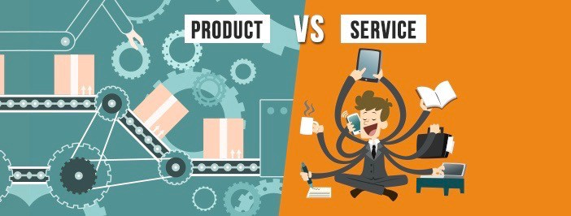

And also WHY I might never look back.

This story is for the folks that are just starting out and have no idea what any industry jargon means. These are thing I wish someone told me at 22!

I started my career in a Service based company. Few months before I did, one of my senior walked up to me & said I should not take this job up & should really look at products that inspire me. So I said — “Like Facebook?” He said ,”Um, maybe start small?”. He went onto tell me how I would get comfortable & lazy if I didn't have something exciting coming my way every week. Two years, 5 kilos heavier(ok maybe that’s exaggerated) I am sad that he was right, I am sadder that he failed to give me a Pros & Cons list to make a better choice. So to anyone that is given a choice, here are 5 reasons you should consider that switch.

1. **Learning is limitless** : Looks like something out of a philosophic book, but really it is so true. I constantly have 100(relevant!) tabs open & I forever have something to hold my attention. In Services, usually half the sites are blocked, you need 100 email permissions & one stubborn IT team to give you access for something even like Medium(of course, this is company to company but I am so grateful I don’t have to see the — You cant access this site message anymore.)

2. **Networking** : Your key network outside your educational institute is the people you work with. In my previous org, I knew some amazing folks that dabbled at design, architecture & built products. However for a decade they were in the same company and to them this is all they could achieve. You will see people that started as an associate and grew to managerial position in 15 years, all right there. When you’re comfortable in your cocoon like that, all you know about is your own growth. The idea of being in the same place, didn't make me feel safe it made me squirmy!

3. **Skills as opposed to politics** : This isn't to say that the Product companies dont have politics however, it cant be only politics.(**Important:** Kids, there is politics everywhere, you cannot escape it, learn your way around.) I remember walking up to a senior architect and asking really basic I-am-a-fresher-I-know-nothing questions & getting no response! I thought they did this because they wanted me to learn, but when the code was in production & no one wanted to fix it, it was clear they weren't all that senior in skills. Skills play a major role in Product, if you are not learning and doing few different courses every week, you will burn out, being your manager’s pet will not save you!

4. **Flat hierarchy** : I really like that most companies are open to the voices of every person at office. No matter how silly their suggestions, they are mostly heard! In services there are many hoops you jump for everything you need done, which is why most people just dont do! It is a hassle when you’ve to write to your management 5 times a month for one licence!

5. **Pampered & rewarded** : It’s a known fact that these companies pay more than services because you’re that precious. If you’re not, you will be asked to move on that fast too. Its a bigger rat race than services is, because you have to prove your worth time and again. You can become obsolete, replaceable any second. That is high risk, therefore you deserve the max benefit. Sounds scary, but as long as you bring value to the table you are always looked after well.

This isn’t to say service industry doesn't work for anyone. It does to amazing managers that can take a release date & stand by it. It works for engineers that want to develops skills that will give you the next big jump! It works for people that are great at what they do & would like to keep doing them. I was none of this, I needed to be the dumbest person in the room so I can learn every second, and I am. It doesn’t feel great everyday, I feel like a cheat that will be caught soon for pretending to be smart, until then I will take it. Someday when I feel like I have learnt enough, I might return to the land of services, although the rate at which technology is going I doubt I will even know 10% of it completely!
