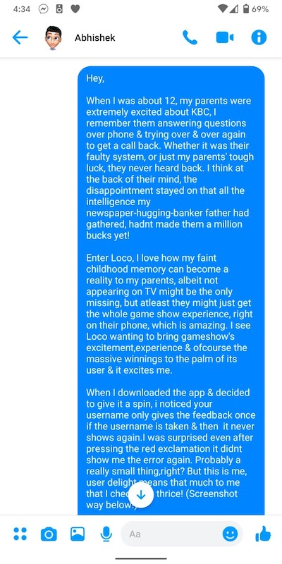

This is a story. You should probably skip this if you were looking for steps, that blog will be up next. But if you were just curious & if you think my way could help you, read away :) 

So like every other science student in India, I studied engineering. I didn’t really want to do that, I wanted to major in English & history, but ah life :)! So I ended up doing computer science. I didn’t go to a well-known college at all, so if you’re asking me how do you get into big companies when you’re from tier - A college, my answer is I don’t know. 

Anyway, I would like to think I was decent at engineering, I graduated with a campus placement(this story is so cliché!). I went on to be an iOS engineer at ITC. I worked in a department that was associated with Innovation. They were supposed to make pitches to clients with prototypes of how they could build innovative solutions for them. So, briefly someone would write a proposal & I would build it. I hated this, for many reasons(which is not worthy to be written, but if you meet me, ask me?) but I mainly hated it because I just didn’t fit in here, I wrote more on the WHY, [here](https://www.vindhyac.com/posts/product-company-vs-service-company/). While, I got these business proposals, sometimes they were not written very well, they didn’t give more information and had no mocks to build apps on. So I used to do them myself, fill the gaps in the document before I coded things. It was clear to me that while I was an average programmer, I could be good at this! That is when I applied to any role I could find that took me to the business side of things. 

I had no idea what product management was at this time. Zero idea. I got into a role at Directi (a company I didn't know was a big deal back then). The role was - Project Management. Since I was at a service - based company, the project managers did most of the business things. The documents, managing team, deciding what to build etc. So in my naive sense, I thought I had the job I wanted. Turns out, it was not. A month into JIRA boards and pinging people if they had finished their tasks, I had realised this was not for me. I was very good at it, though I am told. But, I really liked Directi. I loved the energy, amazing talented folks & great knowledge all around. I took another month to learn all things product. What really helped me was my friendship with the nicest person I could find at work - Sanya! She is a senior designer at Uber now, but back then she was a product manager with Directi. I moved my seating ( I think the best thing I did) to where she sits aka product team sat. I would peep into what they did, asked the silliest questions & asked everyone to teach me something. 

I would go to everyone in the product & design team and say - “ Can you teach me how you did that? That is very cool.” In hindsight, I think it was very silly of me but I really did not know better. So, one day [Manas](https://twitter.com/manas_saloi) ( the twitter’s favourite PM) sat across me and I said the same thing - “Teach me what you do.” If you don't know him, Manas was not an easy person to get help from, but he was also very to the point. He would always gauge if you were putting in the effort, if you had passion and would probably only then even have a conversation with you. So in a very Manas way & I quote him verbatim, he said : 

>“Well, if you really want to be a PM, read this - Cracking the PM interview first, you will learn what all is asked in every interview, once you get that & understand the complexity then we can talk” 

Ok, so I had an in finally! I can do this I thought. *frantically googles the book* . I said, “Alright, I will come back to you when I am done, then.” 

>“Lots of people within this floor ask me every day how to be a PM, it seems so easy & fun. It is that, but it is also a lot of work. No one wants to put in the work. We will probably discuss again in a month, my guess is you would not have finished the book by then too. That’s how everyone is.” - he would tell me the next day. I probably could have said something then but I didn't. 

**Cracking the PM Interview** - is a 400 page odd book, but it taught me so much. I read the whole thing in a few hours perhaps, but I think I did not respond to him right away because I wanted to have something useful to talk next. Of course, I read the book the day he had recommended it, but I went back and read some more articles on the topics in the book. The third day from our original conversation, during a tea break I referenced an article and I asked him a doubt to which he said - “Maybe we can discuss this after you read the book?” “Oh I read it the day you told me to, which is how I landed up here, so tell me about this?” I think out of all the things this PM journey has given me, one of my favourite things will be watching him look at me dumbfounded and with pride :). I will skip the rest of the brag conversation and tell you what we did next. 

So, now he knew I was serious. I also knew I was serious, I knew this is what I saw myself doing. Every other day he set an automated meeting with me to discuss various things. Well, not so much discussion, more critiquing my tasks. He would give me -  redesign, strategy, product thinking question & review my document in this meeting. We did 4 of these meetings. Soon after this, seeing us discuss more designers would get curious and ask us what we were up to. So, Manas held a PM-for dummies 1-hour core session. I remember this entire hour from memory even today. It was really basic but most important stuff. I sat in every product meeting I could, wrote some mock specs & discussed products a lot more. 

So i had the prep work done, now I needed a way to get into doing some product stuff. I didn't know where to start. So, I wrote a four-page document on content strategy for growth & sent it to the CEO & product head. I thought I did a great job(lol) but I barely got a response. So I decided there was no reason to wait around that I should probably interview. That is how, Loco happened. Loco was a - live streaming quiz platform. The tech seemed amazing, I had read a lot on live streaming, the team seemed very small ( this was before the acquisition). They didn't have a team or an opening, but I wrote to Abhishek on Facebook! Because at this stage I didn't 
Even know what twitter could help me achieve! I wrote a really long message, but here is what it concentrated on.  

He asked me to send in my resume, in two days I interviewed and the third day I had an offer, which now I know happened after a discussion with Manas as well. Loco was where I learned so much I was reading hands-on. I meant some very talented people here, but most important people I learned from were - [Sushil](https://twitter.com/Sushilk91) ( one of the cofounders at Loco) he would deep dive into all topics he cared about & was very focused on his learning. I also learned quite a bit from Obvious - a design agency we had worked with to redesign Loco. I remember meeting [Rahul](https://twitter.com/gonsalves_r) here & realizing how little I knew about everything design. [Vikalp](https://twitter.com/vikxlp), at Obvious, was the designer I got a chance to work with & my first interaction with him, like all my previous phases - I said - “ I know nothing about design, what should I learn?” I had obviously asked this question to every designer I met, but he was the first one to send me so much reading material! But, needless to say everyone I worked with taught me something, and I am not just simply saying that. 

Ok so, if you made it this far, here is my closing advice:

1. Read the book 
2. Try writing a product spec and pitch internally at where you work
3. Reach out to people who you think will be able to help, but do some homework. Don't just ask - “How do I become a PM” instead ask - “ Hey, I read this & as a PM I would do this. What do you think? Am I doing this right?” 

When the founders at Loco asked Manas about me, I remember he told them I had a great bias for action. That is exactly what you need - Take action & pursue it. Lots of - how to guides on getting into PM, but I will write a longer one and link it here as well, if you are interested, I will post about it - [@vindytalks](https://twitter.com/vindytalks)

